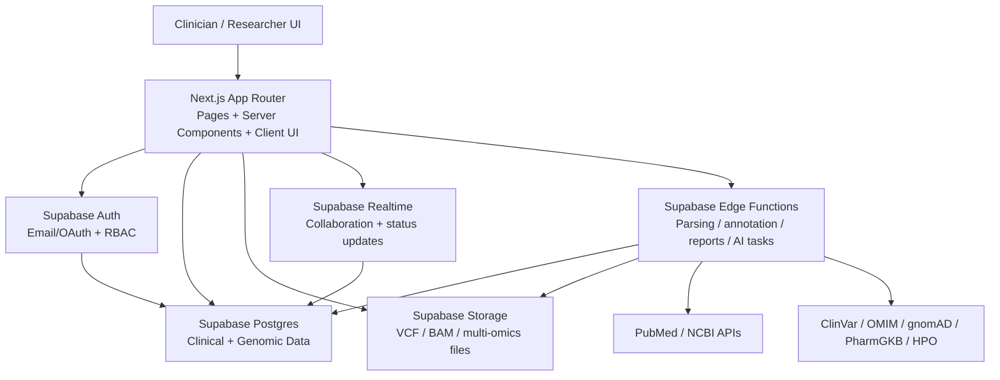

# GenomeIQ System Blueprint

## Goal

Build a clinician- and researcher-facing genomic intelligence platform using **Next.js + Supabase only**.

This blueprint covers:

- system architecture
- folder structure
- database schema
- API design
- Supabase setup
- starter code boundaries
- feature implementation plan

## Architecture Diagram



## System Architecture

### Frontend

- **Next.js App Router** for authenticated dashboard experience.
- **Server Components** for secure data fetching from Supabase.
- **Client Components** only for highly interactive surfaces:
  - drag-and-drop uploads
  - genomic charts
  - literature exploration
  - collaborative comments
  - workflow builder

### Backend

- **Supabase PostgreSQL** is the system of record.
- **Supabase Storage** stores VCFs, reports, QC artifacts, and multi-omics files.
- **Supabase Edge Functions** perform:
  - sample ingestion
  - variant parsing
  - annotation orchestration
  - literature sync
  - report generation
  - batch processing
  - webhook/API integration handling

### Security Model

- **Supabase Auth** with roles: `clinician`, `researcher`, `admin`.
- **Organization-scoped multi-tenancy** via `organization_id`.
- **RLS on all clinical/org-owned tables**.
- **Restricted Storage bucket paths** using org-scoped folder policies.
- **Encrypted at rest** by Supabase platform defaults, plus strict access policies.

### Processing Model

- User uploads genomic file to Storage.
- App inserts `genomic_samples` row with status `uploaded`.
- Edge Function is invoked to:
  - validate file
  - calculate quality metrics
  - parse variants
  - annotate variants
  - map disease / pathway / drug associations
  - persist analysis artifacts
  - update status to `processing`, `completed`, or `failed`

## Product Modules

### Core modules

- genomic variant analysis
- clinical interpretation engine
- disease-gene association database
- pharmacogenomics
- literature mining
- genomic data visualization
- clinical report generation
- multi-omics integration
- population genetics
- quality control
- annotation pipeline
- collaboration workspace
- API integration hub
- consent management
- genomic data security
- batch processing
- custom workflow builder
- genomic calculator suite
- analysis/report version control
- mobile clinical interface

### Differentiating modules

- AI-powered phenotype matching
- real-time genomic monitoring
- predictive disease modeling
- genomic digital twin
- polygenic risk scoring
- structural variant analysis
- epigenomic analysis
- ancestry inference
- clinical decision support
- genomic chatbot assistant
- federated learning framework
- 3D protein structure integration

## Recommended Folder Structure

```text
genome-iq/
  app/
    login/
    auth/
    dashboard/
    patients/
    samples/
    variants/
    reports/
    workflows/
    analytics/
    settings/
    api/
      webhooks/
      integrations/
  components/
    layout/
    auth/
    patients/
    samples/
    variants/
    reports/
    workflows/
    analytics/
    visualization/
    collaboration/
    ui/
  lib/
    supabase/
    auth/
    patients/
    samples/
    variants/
    reports/
    literature/
    workflows/
    analytics/
    visualization/
    calculators/
    security/
    integrations/
  edge-functions/
    sample-processor/
    variant-annotator/
    literature-miner/
    report-generator/
    workflow-runner/
    phenotype-matcher/
    risk-score-engine/
  supabase/
    migrations/
    seed.sql
  docs/
    genomeiq-system-blueprint.md
```

## Database Schema

### Identity and tenancy

- `organizations`
- `users`

### Clinical domain

- `patients`
- `consents`
- `clinical_reports`
- `report_versions`
- `collaboration_comments`

### Genomic / omics domain

- `genomic_samples`
- `quality_metrics`
- `variants`
- `annotations`
- `analysis_results`
- `risk_scores`
- `phenotype_matches`
- `omics_datasets`

### Reference knowledge domain

- `genes`
- `diseases`
- `phenotype_terms`
- `gene_disease_associations`
- `variant_disease_associations`
- `drug_interactions`
- `publications`
- `publication_insights`
- `pathways`
- `gene_pathways`
- `population_data`
- `protein_structures`

### Automation / orchestration domain

- `workflows`
- `workflow_versions`
- `workflow_runs`
- `batch_jobs`
- `integration_endpoints`

## Table Responsibilities

### `patients`

- organization-owned patient demographics
- phenotype summary
- links to consents, samples, reports

### `genomic_samples`

- uploaded file metadata
- sample type
- pipeline status
- processing timestamps

### `variants`

- normalized variant calls
- genomic position
- transcript / HGVS representation
- classification

### `annotations`

- external knowledge overlays from ClinVar / OMIM / gnomAD / PharmGKB / custom rules

### `analysis_results`

- structured downstream interpretations
- diagnostic evidence
- treatment suggestions
- confidence and provenance

### `workflows` + `workflow_runs`

- configurable analysis pipelines
- batch execution and status tracking

## RLS Strategy

### Organization-scoped tables

All of these should have `organization_id` and RLS policies bound to `public.current_org_id()`:

- `patients`
- `consents`
- `genomic_samples`
- `quality_metrics`
- `variants`
- `annotations`
- `clinical_reports`
- `report_versions`
- `analysis_results`
- `phenotype_matches`
- `risk_scores`
- `omics_datasets`
- `workflows`
- `workflow_versions`
- `workflow_runs`
- `batch_jobs`
- `collaboration_comments`
- `integration_endpoints`

### Global reference tables

Read-only to authenticated users:

- `genes`
- `diseases`
- `phenotype_terms`
- `gene_disease_associations`
- `variant_disease_associations`
- `drug_interactions`
- `publications`
- `publication_insights`
- `pathways`
- `gene_pathways`
- `population_data`
- `protein_structures`

## API Design

### Next.js route handlers

- `POST /api/webhooks/lis/sample-ready`
- `POST /api/webhooks/emr/patient-sync`
- `GET /api/patients/:id/report`
- `GET /api/variants/:id`
- `POST /api/workflows/:id/run`
- `GET /api/analytics/summary`

### Supabase Edge Functions

- `sample-processor`
  - validate VCF
  - parse records
  - update `genomic_samples`
- `variant-annotator`
  - enrich variants from public datasets
- `literature-miner`
  - retrieve PubMed papers
  - extract structured insights
- `report-generator`
  - compile report JSON/PDF payloads
- `workflow-runner`
  - execute configurable workflow graphs
- `phenotype-matcher`
  - score phenotype-to-variant matches
- `risk-score-engine`
  - calculate PRS / disease risk models

## Supabase Setup

### Required platform features

- Auth enabled with email/password and optional OAuth
- Storage buckets:
  - `genomic-samples`
  - `clinical-reports`
  - `omics-assets`
  - `qc-artifacts`
- Realtime enabled for:
  - sample processing status
  - collaboration comments
  - report updates
- Edge Functions deployed for pipeline tasks

### Required secrets

- `NEXT_PUBLIC_SUPABASE_URL`
- `NEXT_PUBLIC_SUPABASE_ANON_KEY`
- `SUPABASE_SERVICE_ROLE_KEY`
- `PUBMED_API_KEY`
- `CLINVAR_SOURCE_URL`
- `OMIM_SOURCE_TOKEN`
- `PHARMGKB_SOURCE_KEY`

## Next.js Starter Boundaries

### Server-side data helpers

- `lib/patients/*`
- `lib/samples/*`
- `lib/variants/*`
- `lib/reports/*`
- `lib/workflows/*`
- `lib/analytics/*`

### Interactive UI

- upload widgets
- visualization panels
- collaboration comments
- workflow builder canvas
- clinical calculators

### Visualization stack

Within Next.js only:

- SVG / Canvas / D3-based components
- chromosome tracks
- gene-pathway graphs
- variant classification distributions
- population frequency comparisons

## Feature Implementation Plan

### Phase A: Platform foundation

- auth and organization tenancy
- core dashboard
- patient management
- sample upload
- base RLS and storage policies

### Phase B: Genomic processing

- Edge Function VCF parser
- QC metrics
- sample processing status engine
- variant persistence

### Phase C: Annotation and interpretation

- genes / diseases / phenotype terms
- variant annotation pipeline
- disease-gene and drug interaction mapping
- interpretation engine

### Phase D: Clinical reporting

- structured report model
- report generation UI
- report versioning
- PDF / downloadable summaries

### Phase E: Visualization and analytics

- variant dashboards
- chromosome and gene network views
- population genetics analytics
- risk score explorer

### Phase F: Collaboration and workflows

- comments and review threads
- workflow builder
- workflow runs and batch jobs
- notifications / status feeds

### Phase G: Advanced intelligence

- phenotype matching
- PRS engine
- literature mining
- predictive disease models
- chatbot assistant

### Phase H: Differentiation

- multi-omics
- structural variants
- ancestry
- epigenomics
- digital twin concepts
- federated learning hooks
- protein structure overlays

## Current vs Target

### Already present in this repo

- authentication
- dashboard shell
- patient CRUD entry flow
- sample upload UI
- org-scoped tenancy foundation

### Still backlog

- real VCF parsing
- variant ingestion
- annotation pipeline
- literature mining
- visual analytics
- reports engine
- workflows
- calculators
- advanced AI modules

This document is the target system contract for the next implementation phases.
